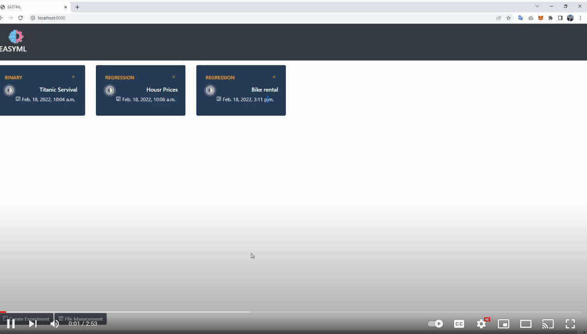
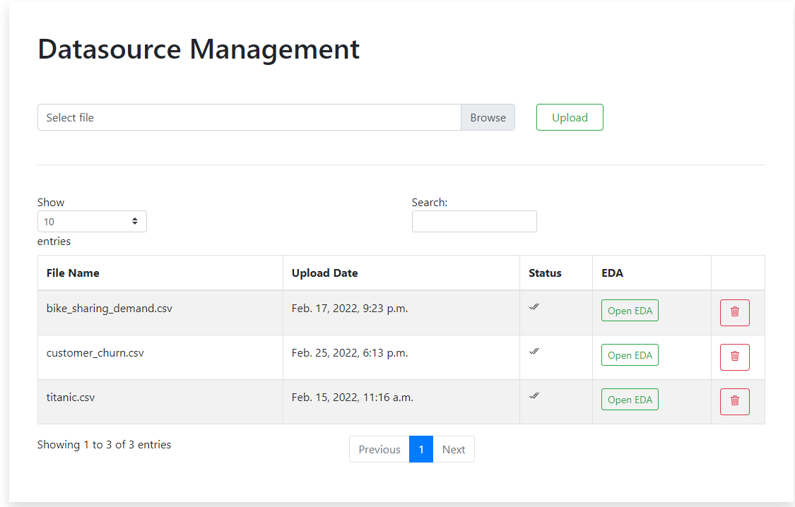
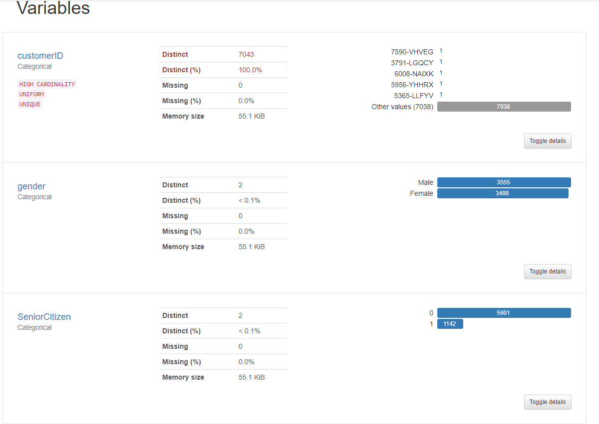
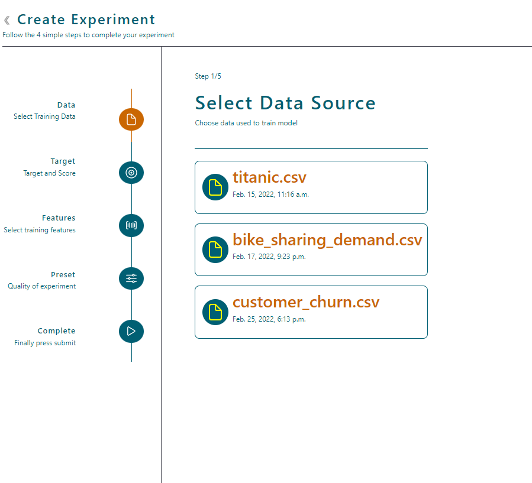
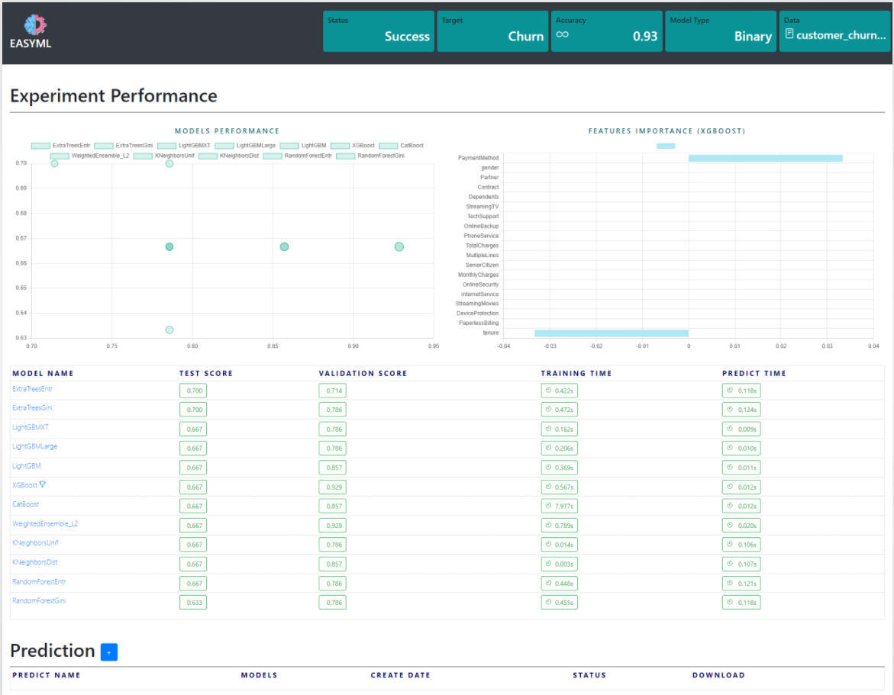
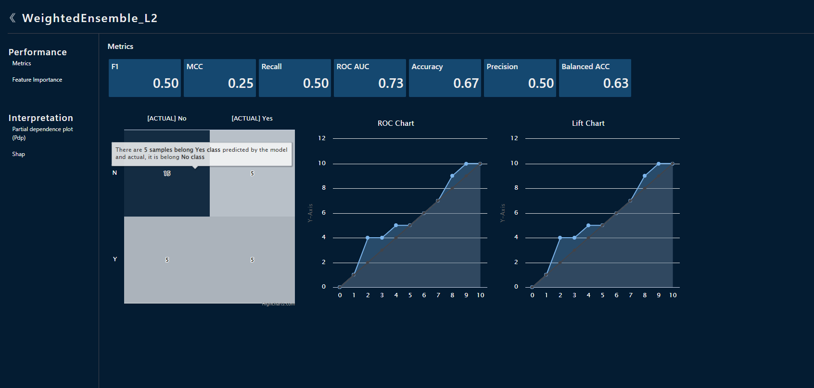

# EASYML
*Auto Machine Learning System*

## 1. Introduce EasyML

EasyML is an Auto Machine Learning web based that help you build Model without any coding. 

All you need todo is upload your data, design your experiment like select target, features, score and submit.
EasyML will help you generate more than 10 models with evaluation score.

*Check bellow video to learn more detail about EasyML system:*

[](https://www.youtube.com/watch?v=jRtNJl3y2as&t)

**There are alot of features need to be added, so it would be great if you can join with me**


## 2. How to use EasyML

Main Page


### 2.1 Upload Data and analysis your data
After build the model, you need upload data by click on **File Management** button.
System now only accept csv file. I will upgrade soon that help customer can upload other file like excel, text.



To EDA your data, click Open EDA. I used PandasProfiling to help me automatic this report.



### 2.2 Create Experiment

Click Experiment, select your data using to build model, choose target, features, train and test split ratio and submit.


### 3. Experiment Detail and Prediction
After Experiment success, you can check the performance at this page.
Although, you can make a prediction with best model score.


### 4. Model Evaluations
By click on models in Leaderboard, you can check more detail about model performance.

This function still implementing. I will release it as soon as possible.



### 5. How to install

#### pip install -r src/requirements.txt

#### Install Redis

#### Install PostgresSQL

#### Go to src/mlplatform/settings.py and change database config

Change the database config to your postgresql config

``` python
DATABASES = {
    'default': {
        'ENGINE': 'django.db.backends.postgresql',
        'NAME': 'mlplatform',
        'USER': 'postgres',
        'PASSWORD': 1228,
        'HOST': 'localhost',
        'PORT': 5432,
    }
}
```

Change the Celery config 

``` python
CELERY_BROKER_URL = 'redis://localhost:6379'
CELERY_RESULT_BACKEND = 'redis://localhost:6379'

```

### 6. How to run

#### Django Database migration
```python
python manage.py migrate
```

#### Manually add data from script
run src/scripts/load_scrap.py, run it `three` times to add data from csv files.

```python
if __name__ == '__main__':
    #run()
    #run_giesserei()
    run_chemi()
```

#### Check PostgresSQL from interface (pg Admin4)
if there are not data available, run

```python
python manage.py migrate --run-syncdb
```
to sync the dataset


#### Start django service
```python
python manage.py runserver --noreload
```

#### Start worker (new terminal)
```python
celery -A mlplatform worker -s /tmp/tmp.db --pool=solo -l info
```

#### Start celery flower service (optional, new terminal)
```python
celery -A mlplatform flower --port=5555 
```